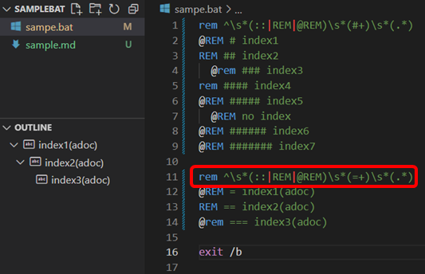

# Bat tools README

Bat tools

This is the Bat tools.

- Create outline from bat comments

  

  

## Requirement

- Windows 10

## Features

- Create outline for a bat file.

  Comment '@rem # outlineXXX ' is collected for outline.

## Settings

- Outline: fileType

  default type is "bat". if others you want, separate extensions with comma.
  ex. "bat,txt,log"

- Outline: Indexing Word

  ^\s*(::|REM|@REM)\s*(#+)\s*(.*) is default setting.
  3rd match is title, second match is for indexing.

- Outline: Is Hierarchy

  If On, support outline hierarchy.

## How to build

https://code.visualstudio.com/api/working-with-extensions/publishing-extension

```
npm install -g vsce
vsce package --target win32-x64
vsce publish
```

## Acknowledgements

We use the following modules. Thank you very much.

[see modules](./USEDMODULES.md)

Create by [license-report](https://www.npmjs.com/package/license-report)

## Release Notes

[see change log](./CHANGELOG.md)
