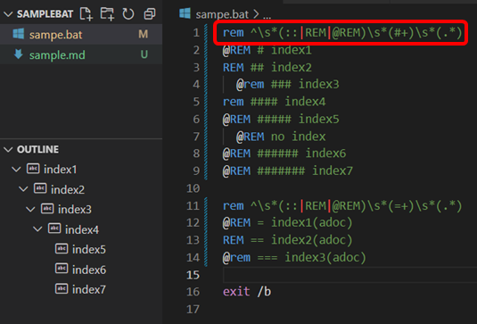

# Bat tools README

Bat tools

This is the Bat tools.

* Create outline from bat comments

    

## Requirement


* Windows 10

## Features


* Create outline for a bat file.

    Comment '@rem # outlineXXX ' is collected for outline.

## How to build


https://code.visualstudio.com/api/working-with-extensions/publishing-extension

```

npm install -g vsce
vsce package --target win32-x64
vsce publish

```

## Acknowledgements


We use the following modules. Thank you very much.

[see modules](./usedmodules.md)

Create by [license-report](https://www.npmjs.com/package/license-report)

## Release Notes


[see change log](./CHANGELOG.md)

